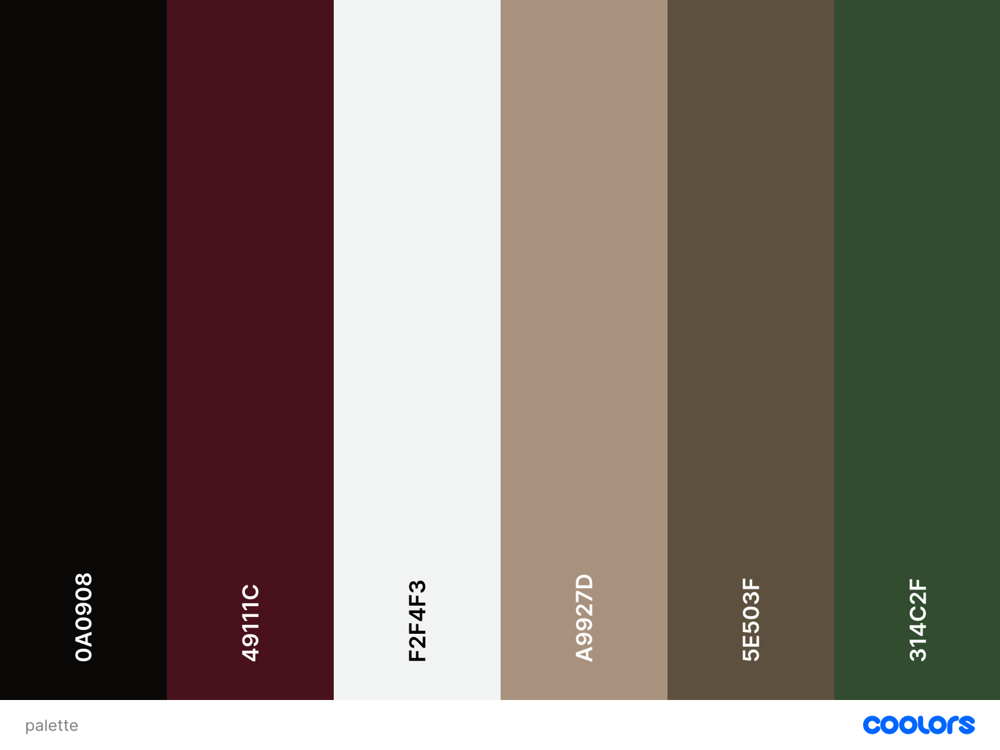

# README 

## ⚖️ Licenza

Questo progetto utilizza un sistema di doppia licenza per proteggere sia il software che i dati:

- **Codice Sorgente (`.js`, `.py`, `.html`, `.css`):** È rilasciato sotto licenza [GNU AGPLv3](LICENSE). Se modifichi o utilizzi questo codice, devi rendere pubblico il codice sorgente modificato.
- **Contenuti e Catalogo (`json/`, `img/`, `md/`):** Le domande, le immagini e i dati sono rilasciati sotto licenza [Creative Commons Attribution-ShareAlike 4.0 International (CC BY-SA 4.0)](LICENSE-CONTENT). Se aggiungi o modifichi domande al catalogo, devi rendere pubblico il catalogo aggiornato sotto questa stessa licenza.

In sintesi: chiunque modifichi il quiz o le domande è obbligato a "restituire" le modifiche alla comunità rendendole pubbliche.

## Come aggiungere domande
È sufficiente aggiungerle nel formato corretto, nel json **catalog.json**

Un medoto più semplice potrebbe essere seguire i seguenti passaggi: 
1. creare con IA (chatgpt) un file .md con all'interno tutte le domande che si vogliono aggiungere, è importatnte seguire il formato usato in [Quiz.md](md/Quiz.md)
2. Aggiungere le domande formattate, in [domandeNew.md](md/domandeNew.md)
3. Eseguire lo script [identifica_domande_nuove_aggiornando_catalog.py](script/identifica_domande_nuove_aggiornando_catalog.py)
4. Aggiorna [Quiz.md](md/Quiz.md) con le domande appena aggiunge e svuota [domandeNew.md](md/domandeNew.md) senza cancellare il file.
5. Se sono presenti delle domande con immagini, è necessario aggiungere un'immagine per ogni domanda in [img](img) chiamandola con il numero che assume la relativa domanda.  
   1. Aggiungere il percorso di ogni immagine e il relativo campo all'array nel file [catalog.json](json/catalog.json)

## Colori

La palette che è stata usata è [questa](https://coolors.co/0a0908-49111c-f2f4f3-a9927d-5e503f-314c2f).

| colore | esadecimale |
|---|---|
| Cal Poly green            | #314C2F | 
| Chocolate cosmos (rosso)  | #49111C | 
| Black (nero)              | #0A0908 | 
| White smoke               | #F2F4F3 | 
| Beaver                    | #A9927D | 
| Walnut brown              | #5E503F | 
